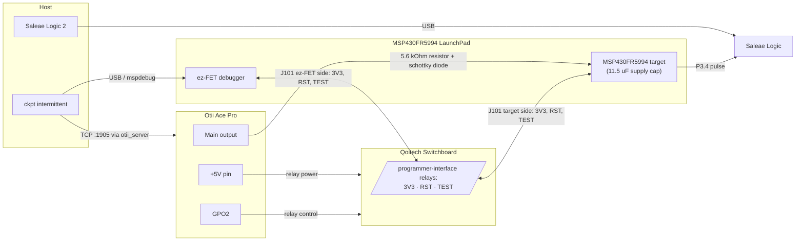

# Intermittent-Power Measurement Setup

`ckpt intermittent` runs benchmarks on an MSP430FR5994 powered by an Otii Ace
Pro that replays a recorded energy-harvesting trace, so the program really
loses power and recovers from checkpoints. This document is the single source
of truth for this measurement setup's wiring and software.

## Hardware

- **Otii Ace Pro** — replays the voltage trace on its main output and drives
  the switchboard.
- **Qoitech Switchboard** — its *programmer interface* (a pair of 10-pin
  headers whose relays switch pins 1/VCC, 2/SWDIO, 4/SWDCLK, 10/nRESET)
  connects/disconnects the ez-FET debugger's `3V3`, `SBW RST`, and `SBW TEST`
  lines. The target must be fully isolated from the debugger while it runs on
  replayed power. The switchboard's USB interface is **not** used: cutting
  host USB would only de-power the ez-FET while its pins stay on the target
  rails, and the target would drain through their ESD protection diodes.
- **MSP430FR5994 LaunchPad** — the board's supply capacitance is 11.5 µF
  (`benchmarks/config_board.json`). The on-board ez-FET stays on host USB the
  whole time; only its jumper lines to the target side are switched.
- **5.6 kΩ series resistor** — between the Otii main output and the schottky
  diode. It limits the charging current to a realistic harvester level; the
  Otii itself is a stiff voltage source.
- **Schottky diode** — in series after the resistor, in front of the board
  supply rail (anode toward the Otii, cathode at the board). It blocks
  back-feed into the Otii output while the ez-FET's 3V3 powers the board for
  flashing and readback.
- **Saleae Logic** — wired to P3.4 as in [saleae.md](saleae.md). It captures
  the benchmark start/stop pulses during the replay: completion detection
  and execution time both come from this capture.

## Wiring Diagram

## Connections

| From | To | Notes |
|------|----|-------|
| Otii main output `+` | Board supply rail | Through the 5.6 kΩ resistor, then the schottky diode (anode toward the Otii, cathode → board) |
| Otii main output `−` | Board GND | Common ground with everything below |
| Otii `+5V` pin | Switchboard relay power | Via the 14-pin expansion-port connector; relays are unpowered (open) when the Otii is off |
| Otii `GPO2` (expansion port) | Switchboard relay control | Jumper on the switchboard's 3-pin header set to the GPO2 side; high = relays closed |
| ez-FET `3V3` (J101 ez-FET side) | Programmer-interface IN pin 1 → OUT pin 1 → target `3V3` (J101 target side) | Switched (VCC relay) |
| ez-FET `RST`/SBWTDIO (J101 ez-FET side) | Programmer-interface IN pin 2 → OUT pin 2 → target `RST` | Switched (SWDIO relay) |
| ez-FET `TEST`/SBWTCK (J101 ez-FET side) | Programmer-interface IN pin 4 → OUT pin 4 → target `TEST` | Switched (SWDCLK relay) |
| LaunchPad `GND` jumper (J101) | — | Left mounted: ground stays common at all times, not routed through the switchboard |
| Host USB | ez-FET USB connector | Direct — the switchboard's USB interface is not used |
| Saleae digital channel 0 | MSP430 `P3.4` | Start/stop pulses: completion detection + execution time |
| Saleae GND | Board GND | |

On the LaunchPad's J101 isolation block, only the `GND` jumper stays mounted.
`3V3`, `RST`, and `TEST` are rerouted through the switchboard's 2.54 mm
programmer-interface header pair with jumper wires (pin numbers must match on
the IN and OUT headers; the pin-10 nRESET relay is unused here). All other
jumpers (`5V`, `RXD`, `TXD`) stay off — any line left connected can
back-power or leak current into the isolated target through pin protection
diodes and distort the measurement.

The target must never see both supplies at once: the runner keeps the Otii
main output off whenever the relays are closed, and the schottky diode blocks
back-feed into the Otii output while the ez-FET's 3V3 powers the board.

## Continuous-Power Runs (`ckpt bench`, `ckpt verify`)

With an Otii in the loop, `bench` and `verify` use the same relays: the
target is flashed through them, then isolated and powered from the Otii main
output at a constant 3.3 V for the run, and reconnected for the NVM readback.
Running the target on the ez-FET's 3V3 rail instead is not reliable — the
ez-FET resets the target over SBW a few seconds after `mspdebug` releases it
(see issue #72). For these runs wire the Otii main output **directly** to the
board supply rail, without the 5.6 kΩ resistor and the schottky diode: at
3.3 V the target draws milliamps, and the current-limited harvester path
cannot hold the rail. Without an Otii both commands fall back to running on
the ez-FET's 3V3 rail.

Every such run starts from a cold supply, so the Saleae sees a sub-microsecond
glitch on P3.4 while VCC ramps, ahead of the real start pulse (see
[saleae.md](saleae.md)); the extractor ignores pulses narrower than 2 µs.

## How a Run Works

For each (benchmark, capacitor, trace):

1. **Flash** — relays closed (`GPO2` high), Otii main off. The ELF is
   programmed via `mspdebug`, the target is held halted under JTAG, and a
   Saleae capture is armed (trigger: `PULSE_HIGH` ≥ 1 ms, as in
   [saleae.md](saleae.md)).
2. **Isolate** — relays open while the target is still halted, so it loses
   power without ever running on the debugger's 3V3 rail. NVM stays exactly
   as programmed.
3. **Replay** — the Otii main output replays the trace
   (`benchmarks/traces/*.csv`, 20 ms samples). The BENCH_EXIT stop pulse
   (~5 ms high on P3.4) fires the Saleae trigger, which ends the replay
   early; no trigger by the end of the trace means `status=incomplete`.
   Execution time is the first start-pulse falling edge to the stop-pulse
   rising edge, outages included.
4. **Readback** — main off, relays closed again, NVM read via `mspdebug`
   (`__nvm_done`, `__nvm_violation`, `cnt_recovery`, and with
   `--device-debug` — off by default, its counter updates and UART cost
   energy — also `cnt_boundary` and the result). Completed and violated
   runs park at boot, so their NVM state survives the reconnect.

Binaries are always linked in the `wait` halt mode (there is no `--halt-mode`
option here): region boundaries wait for the capacitor to recharge instead of
emulating outages, and real power failures recover through the checkpoint
path.

After the run the relays are left open, so the ez-FET stays disconnected
from the target: `ckpt bench`/`verify` will not find a device until a later
intermittent run (or manual GPO2 control) closes the relays again.

## Software

1. Install the [Otii software](https://www.qoitech.com/download/) and locate
   the `otii_server` binary; export its path as `OTII_SERVER_BIN` (the runner
   starts and stops the server itself).
2. Set up Saleae Logic 2 with the automation server enabled, as described in
   [saleae.md](saleae.md), and keep it running.
3. Install the Python bindings: `uv sync --extra otii --extra saleae`.
4. Run, e.g.: `uv run ckpt intermittent milp crc --trace 1,2` (capacitor
   defaults to the 11.5 µF board config).
