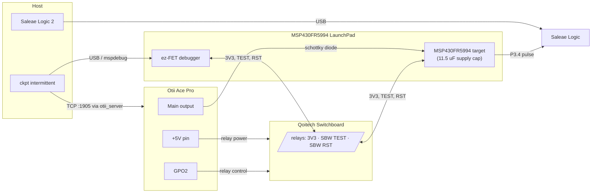

# Intermittent-Power Measurement Setup

`ckpt intermittent` runs benchmarks on an MSP430FR5994 powered by an Otii Ace
Pro that replays a recorded energy-harvesting trace, so the program really
loses power and recovers from checkpoints. This document is the single source
of truth for the hardware wiring and software setup.

## Hardware

- **Otii Ace Pro** — replays the voltage trace on its main output and drives
  the switchboard.
- **Qoitech Switchboard** — relays that connect/disconnect the ez-FET
  debugger's `3V3`, `SBW TEST`, and `SBW RST` jumper lines. The target must be
  fully isolated from the debugger while it runs on replayed power.
- **MSP430FR5994 LaunchPad** — the board's supply capacitance is 11.5 µF
  (`benchmarks/config_board.json`). The on-board ez-FET stays on host USB the
  whole time; only its jumper lines to the target side are switched.
- **Schottky diode** — in series between the Otii main output and the board
  supply rail (anode at the Otii, cathode at the board). It blocks back-feed
  into the Otii output while the ez-FET's 3V3 powers the board for flashing
  and readback.
- **Saleae Logic** — wired to P3.4 as in [saleae.md](saleae.md). It captures
  the benchmark start/stop pulses during the replay: completion detection
  and execution time both come from this capture.

## Wiring Diagram

## Connections

| From | To | Notes |
|------|----|-------|
| Otii main output `+` | Board supply rail | Through the schottky diode: anode → Otii, cathode → board |
| Otii main output `−` | Board GND | Common ground with everything below |
| Otii `+5V` pin | Switchboard relay power | Relays are unpowered (open) when the Otii is off |
| Otii `GPO2` (expansion port) | Switchboard control input | High = relays closed (debugger connected) |
| ez-FET `3V3` jumper | Switchboard channel 1 → target `3V3` | Switched |
| ez-FET `SBW TEST` jumper | Switchboard channel 2 → target `TEST` | Switched |
| ez-FET `SBW RST` jumper | Switchboard channel 3 → target `RST` | Switched |
| Saleae digital channel 0 | MSP430 `P3.4` | Start/stop pulses: completion detection + execution time |
| Saleae GND | Board GND | |

Remove all remaining ez-FET↔target jumpers (RXD, TXD, ...) — any line left
connected can back-power or leak current into the isolated target through pin
protection diodes and distort the measurement.

The target must never see both supplies at once: the runner keeps the Otii
main output off whenever the relays are closed, and the schottky diode blocks
back-feed into the Otii output while the ez-FET's 3V3 powers the board.

## How a Run Works

For each (benchmark, capacitor, trace):

1. **Flash** — relays closed (`GPO2` high), Otii main off. The ELF is
   programmed via `mspdebug`, the target is held halted under JTAG, and a
   Saleae capture is armed (trigger: `PULSE_HIGH` ≥ 1 ms, as in
   [saleae.md](saleae.md)).
2. **Isolate** — relays open while the target is still halted, so it loses
   power without ever running on the debugger's 3V3 rail. NVM stays exactly
   as programmed.
3. **Replay** — the Otii main output replays the whole trace
   (`benchmarks/traces/*.csv`, 20 ms samples). The BENCH_EXIT stop pulse
   (~5 ms high on P3.4) fires the Saleae trigger; no trigger by the end of
   the trace means `status=incomplete`. Execution time is the first
   start-pulse falling edge to the stop-pulse rising edge, outages included.
   A completed run parks at every later boot (`park_if_done`), so replaying
   the rest of the trace is harmless.
4. **Readback** — main off, relays closed again, NVM read via `mspdebug`
   (`__nvm_done`, `__nvm_violation`, `cnt_recovery`, and with
   `--device-debug` also `cnt_boundary` and the result). Completed and
   violated runs park at boot, so their NVM state survives the reconnect.

Binaries are always linked with `--halt-mode wait`: region boundaries wait
for the capacitor to recharge instead of emulating outages, and real power
failures recover through the checkpoint path.

After the run the relays are left open, so the ez-FET stays disconnected
from the target: `ckpt bench`/`verify` will not find a device until a later
intermittent run (or manual GPO2 control) closes the relays again.

## Software

1. Install the [Otii software](https://www.qoitech.com/download/) and locate
   the `otii_server` binary; export its path as `OTII_SERVER_BIN` (the runner
   starts and stops the server itself).
2. Set up Saleae Logic 2 with the automation server enabled, as described in
   [saleae.md](saleae.md), and keep it running.
3. Install the Python bindings: `uv sync --extra otii --extra saleae`.
4. Run, e.g.: `uv run ckpt intermittent milp crc --trace 1,2` (capacitor
   defaults to the 11.5 µF board config).
